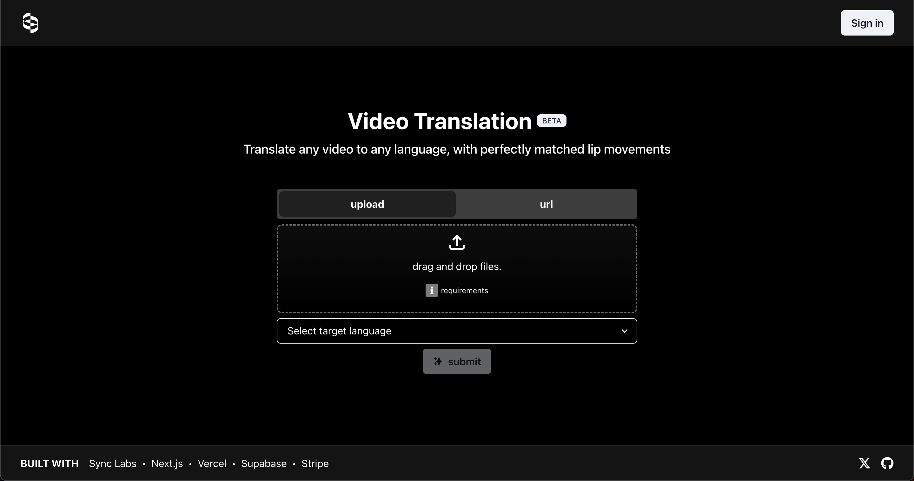
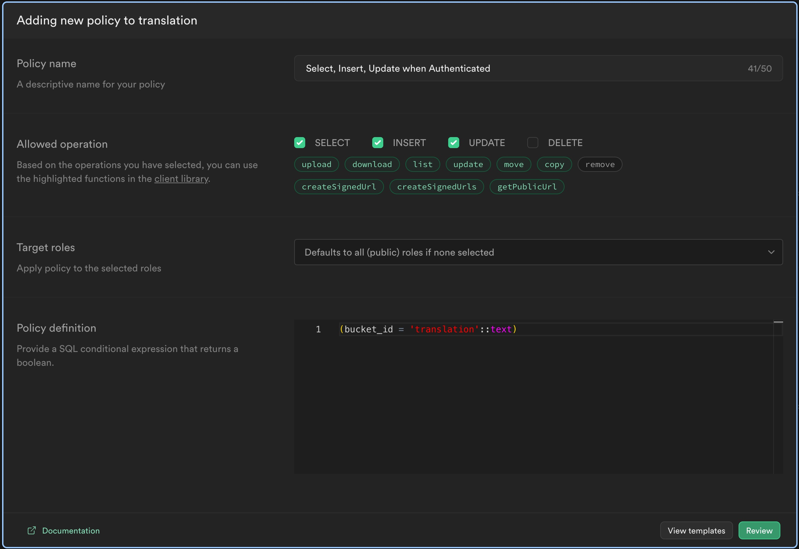
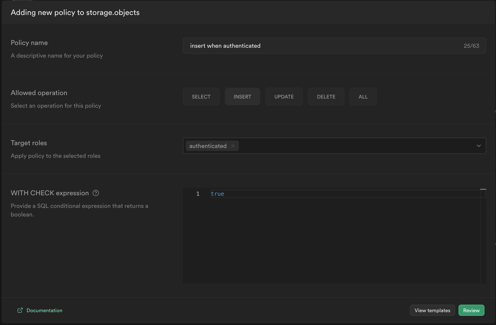
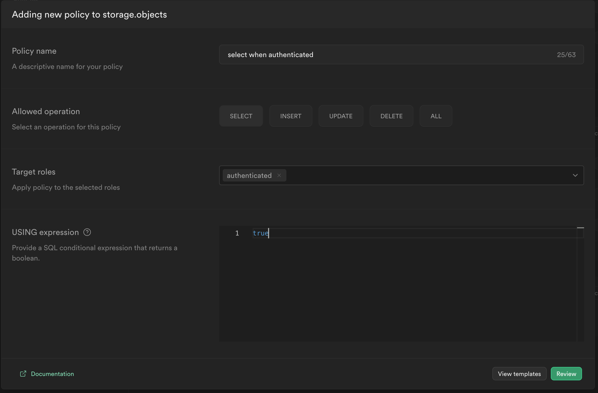

# babelfish by [sync.](https://synclabs.so)

> This repo lets you deploy an app that can translate any video into any language with perfect lip-sync using AI **<15 mins**

[](https://vercel.com/new/clone?repository-url=https%3A%2F%2Fgithub.com%2Fsynchronicity-labs%2Ftranslation-starter&env=SYNC_LABS_API_KEY,GLADIA_API_KEY,ELEVEN_LABS_API_KEY&envDescription=API%20Keys%20and%20other%20environement%20variables%20required%20for%20this%20app%20to%20function%20correctly.&envLink=https%3A%2F%2Fgithub.com%2Fsynchronicity-labs%2Ftranslation-starter%231-initiate-deployment&project-name=translation-starter&repository-name=translation-starter&integration-ids=oac_VqOgBHqhEoFTPzGkPd7L0iH6,oac_H9biZULoTuJYFO32xkUydDmT&external-id=https%3A%2F%2Fgithub.com%2Fsynchronicity-labs%2Ftranslation-starter%2Ftree%2Fmain)

- [babelfish by sync.](#babelfish-by-sync)
  - [tldr](#tldr)
  - [How its built](#how-its-built)
    - [High Level Diagram](#high-level-diagram)
    - [What its built with](#what-its-built-with)
    - [Live demo](#live-demo)
  - [Deploying the production-ready app](#deploying-the-production-ready-app)
    - [1. Initiate Deployment](#1-initiate-deployment)
    - [2. Configure Auth](#2-configure-auth)
    - [3. Configure Storage](#3-configure-storage)
    - [4. (Optional) Configure Stripe](#4-optional-configure-stripe)
    - [5. (Optional) Set up OAuth with Github](#5-optional-set-up-oauth-with-github)
    - [6. (Optional) Create AWS Lambda function for uploading Youtube URLs](#6-optional-create-aws-lambda-function-for-uploading-youtube-urls)
  - [Running the NextJS app locally](#running-the-nextjs-app-locally)
    - [1. Clone your GitHub repository to your local machine and make sure to use Node version 19.1.0 or above.](#1-clone-your-github-repository-to-your-local-machine-and-make-sure-to-use-node-version-1910-or-above)
    - [2. Set up local environment variables](#2-set-up-local-environment-variables)
    - [4. Test webhooks using the `Stripe CLI` (optional)](#4-test-webhooks-using-the-stripe-cli-optional)
    - [5. Install dependencies and run the project](#5-install-dependencies-and-run-the-project)
  - [FAQ](#faq)
    - [How to Contribute](#how-to-contribute)
    - [Additional Resources](#additional-resources)
    - [License](#license)
    - [Common Problems](#common-problems)


## tldr
launch your own video translation app w/ this repo. in <15 mins you can integrate video translation, voice cloning, and lip-syncing into your business / workflows.

## How its built

### High Level Diagram

<!-- TODO: @Noah -- put in a high level diagram of the customer flow using Figjam (in Figma) -->

### What its built with

- [Sync Labs](https://synclabs.so) for perfectly synchronized lip movements
- [Gladia](https://www.gladia.io/) for transcribing
- [Eleven Labs](https://elevenlabs.io/) for voice cloning and speech synthesis
- [Next.js](https://nextjs.org) for web app
- [Vercel](https://vercel.com) for deployment
- [Supabase](https://supabase.io) for db, auth and storage
- [Inngest](https://www.inngest.com/) for servless queues
- [Stripe](https://stripe.com) for billing

### [Live demo](https://translation-starter-khaki.vercel.app/)

You can access the live demo by clicking the image below, [or by clicking here](https://translation-starter-khaki.vercel.app/).

[](https://translate.synclabs.so/)

## Deploying the production-ready app

To successfully deploy the template to production, execute the following steps in order:

### 1. Initiate Deployment

[](https://vercel.com/new/clone?repository-url=https%3A%2F%2Fgithub.com%2Fsynchronicity-labs%2Ftranslation-starter&env=SYNC_LABS_API_KEY,GLADIA_API_KEY,ELEVEN_LABS_API_KEY&envDescription=API%20Keys%20and%20other%20environement%20variables%20required%20for%20this%20app%20to%20function%20correctly.&envLink=https%3A%2F%2Fgithub.com%2Fsynchronicity-labs%2Ftranslation-starter%231-initiate-deployment&project-name=translation-starter&repository-name=translation-starter&integration-ids=oac_VqOgBHqhEoFTPzGkPd7L0iH6,oac_H9biZULoTuJYFO32xkUydDmT&external-id=https%3A%2F%2Fgithub.com%2Fsynchronicity-labs%2Ftranslation-starter%2Ftree%2Fmain)

Clicking the Deploy button will open up a browser tab with instructions on generating a new GitHub repository from this template, creating a corrseponding project in Supabase for `auth` and `storage` and setting up Inngest for serverless queues. Below are the steps you'll walk through:

1. Create Git Repository

    - Under `Git Scope` select the account you'd like to deploy the repo to.
    - Under `Repository Name` give your new repo a name.

2. Add Integrations

    - The [Supabase Vercel Deploy Integration](https://vercel.com/integrations/supabase) handles configuration of environment variables and initiates the [SQL migrations](./supabase/migrations/20230530034630_init.sql) to construct your database schema. You can view the resulting tables in your project's [Table editor](https://app.supabase.com/project/_/editor).

      - Click `Add` in the Supabase integration and fill out the form that pops up.

    - The [Inngest Vercel Integration](https://vercel.com/integrations/inngest) handles configuration of environment variables related to Inngest.

      - Click `Add` in the Inngest integration and fill out the form that pops up.

3. Configure Project

    Enter the environment variables required for this project. Below are links to documentation on how to obtain an API key for each of the required services to ensure full functionality.

    - [Sync Labs](https://docs.synclabs.so/authentication)
    - [Gladia](https://docs.gladia.io/reference/overview#getting-your-api-key)
    - [Eleven Labs](https://elevenlabs.io/docs/api-reference/authentication)

### 2. Configure Auth

You'll need to configure your Supabase project's site URL and Vercel's `NEXT_PUBLIC_SITE_URL` and `NEXT_PUBLIC_TRANSLATION_API` environment variable to secure and streamline authentication.

1. In your Supabase project, navigate to `Authentication` > [URL configuration](https://app.supabase.com/project/_/auth/url-configuration) and enter your production URL (for example, https://your-deployment-url.vercel.app) as the site URL.

2. In Vercel, under your project's deployment settings, create two new Production environment variables called `NEXT_PUBLIC_SITE_URL` and `NEXT_PUBLIC_TRANSLATION_API` and set both to your production URL. Make sure you uncheck the options for preview and development environments to maintain the correct operation for preview branches and local development.

### 3. Configure Storage

After that, you'll need to create a new storage bucket within your Supabase project to store video and audio files.

1. In your Supabase project, navigate to `Storage` and click the `New bucket` button.
   
2. Enter `translation` as the name for your new bucket and toggle `Public bucket` to on.

3. Click `Save`

4. Still in the `Storage` section of your Supabase project, click `Policies` and add the below policy:

  - Within the section called `translation` (the name of your bucket) click `New policy` then `For full costumization` and fill it in as shown below:

    [](https://translation-phi.vercel.app/)

  - Within the section called `Other policies under storage.objects` add the following three policies:

    [](https://translation-phi.vercel.app/)

    [](https://translation-phi.vercel.app/)

    [](https://translation-phi.vercel.app/)

### 4. (Optional) Configure Stripe

Next, you'll need to configure [Stripe](https://stripe.com/) in order to handle test payments.

[Click here to view the instructions.](./docs/setup/stripe.md)

### 5. (Optional) Set up OAuth with Github

In order to allow users to sign up via Github, you'll need to setup OAuth with Github

[Click here to view the instructions.](./docs/setup/oauth-with-github.md)

### 6. (Optional) Create AWS Lambda function for uploading Youtube URLs

Finally, you'll need to create a Lambda function for uploading Youtube videos to Supabase Storage

[Click here to view the instructions.](./docs/setup/youtube-to-supabase.md)

## Running the NextJS app locally

When you innevitably want to make changes to the app, you'll need to run it locally.

You can deploy a second Supabase project so that you have an environment to use for local development, but this tutorial will assume you're using the Supabase project that you deployed in the top section.


### 1. Clone your GitHub repository to your local machine and make sure to use Node version 19.1.0 or above.

Clone the repository however you prefer.

### 2. Set up local environment variables

You can initialize a `.env.local` file by running:

<!-- TODO @Noah: confirm this example file contains all the required variables (EMPTY) -->
```bash
cp .env.local.example .env.local
```

### 4. Test webhooks using the `Stripe CLI` (optional)

If you're setting up the app to include payments, you must run the Stripe CLI to simulate the webhook events.

- Install the [Stripe CLI](https://stripe.com/docs/stripe-cli)
- [Link](https://stripe.com/docs/stripe-cli#login-account) your Stripe account.

In a seperate terminal, run the below command to initiate local webhook forwarding

```bash
stripe listen --forward-to=localhost:3000/api/webhooks
```

> Running this Stripe command will print a webhook secret (`whsec_***`), to the console.
> 
> **IMPORTANT** -- Set `STRIPE_WEBHOOK_SECRET` to this value in your `.env.local` file.

### 5. Install dependencies and run the project

In a separate terminal, navigate to your project's root directory and run the following commands to install dependencies and start the dev server

```bash
yarn
yarn dev
```

Open your web browser and visit http://localhost:3000 to view your application.

## FAQ

### How to Contribute

We embrace the collaborative spirit of the open-source community.

To suggest enhancements or submit changes:

1. Fork the repository.
2. Create a new branch from `dev` for your changes.
3. Commit your updates and push to your fork.
4. Submit a pull request back to the `dev` branch of the original repository.

Your contributions are highly appreciated!

### Additional Resources

- Sync Labs [Slack Community](https://syncbetatesters.slack.com/ssb/redirect#/shared-invite/email)
- Sync Labs [Docs](https://docs.synclabs.so/)

### License

Translation AI is released under the [MIT License](https://choosealicense.com/licenses/mit/).

### Common Problems

If you run into **any issues**, please contact us in the `#translation-app` channel in our Slack (click here to quickly join the channel).

You can also submit an issue to this repo.